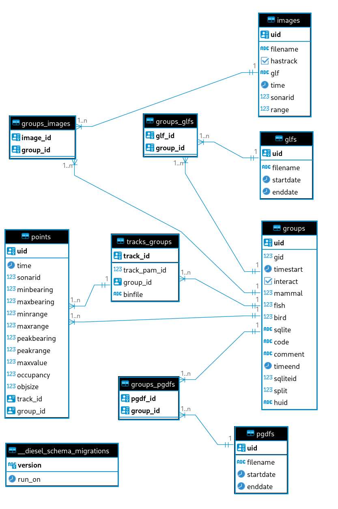

# The Sealhits Database

The major component of the sealhits program is the postgresql database at it's heart. This database is used to house all the required information to produce the tracks and images recorded by SMRU. It derives it's data from the SQLITE files exported by PAMGuard, the PGDF files from PAMGuard and the Tritech Gemini GLF files.

## Overview

There are a total of 5 main tables and 4 support tables in the database. These are:

* glfs - a list of all the glf files considered.
* groups - the groups formed of tracks and annotations. The main table.
* images - a list of all the images extracted from the GLF files.
* pgdfs - a list of all the pgdfs considered.
* points - a list of all the points required to recreate the tracks.
* tracks_groups - a list of all the tracks, their details and which group they belong to.

In addition, the following minor tables are used to form relationships

* groups_glfs - which glfs are needed for which group.
* groups_images - which images belong to which groups.
* groups_pgdfs - which pgdfs correspond to which groups.
* _diesel_schema_migrations - a table for the rust library diesel.

An annotated group and its associated points and images are the three main table to be considered. See the [How to Guides](how-to-guides.md) for examples of how to setup a postgresql query to select points and images for a particular group.

## Schemas

The following is the SQL for each table and what the columns represent.

Throughout, the uid field is a unique key. Furthermore, each table has a unique composite key used to prevent accidental duplication. This allows for re-ingesting files without fear of duplicating data.

### glfs

    ALTER TABLE public.glfs ADD filename varchar NOT NULL;
    ALTER TABLE public.glfs ADD startdate timestamptz NOT NULL;
    ALTER TABLE public.glfs ADD enddate timestamptz NOT NULL;
    ALTER TABLE public.glfs ADD uid bigserial NOT NULL;

* filename - the filename of the glf as it appears on disk - no path.
* startdate - the startdate of this glf read from the glf config file. Date is in UTC.
* enddate - the enddate of this glf read from the glf config file. Date is in UTC.
* uid - a unique identifier for this glf - a UUID4 generated randomly on creation.

### groups

    ALTER TABLE public."groups" ADD uid uuid NOT NULL DEFAULT gen_random_uuid();
    ALTER TABLE public."groups" ADD gid int8 NOT NULL;
    ALTER TABLE public."groups" ADD timestart timestamptz NOT NULL;
    ALTER TABLE public."groups" ADD interact bool NOT NULL DEFAULT false;
    ALTER TABLE public."groups" ADD mammal int4 NOT NULL;
    ALTER TABLE public."groups" ADD fish int4 NOT NULL;
    ALTER TABLE public."groups" ADD bird int4 NOT NULL;
    ALTER TABLE public."groups" ADD sqlite varchar NOT NULL;
    ALTER TABLE public."groups" ADD code varchar NOT NULL;
    ALTER TABLE public."groups" ADD "comment" text NULL;
    ALTER TABLE public."groups" ADD timeend timestamptz NOT NULL;
    ALTER TABLE public."groups" ADD sqliteid int8 NOT NULL;
    ALTER TABLE public."groups" ADD split int4 NOT NULL DEFAULT 0;
    ALTER TABLE public."groups" ADD  huid varchar DEFAULT gen_random_uuid() NOT NULL;

* uid - a unique identifier for this glf - a UUID4 generated randomly on creation.
* gid - the uid taken from the sqlite file. Not guaranteed to be unique.
* timestart - the starting time in UTC, taken from the SQLITE file, altered by the 'buffer' parameter from ingest.py.
* interact - was there an interaction? Human labelled annotation.
* mammal - mammal rating. Human labelled annotation.
* fish - fish rating. Human labelled annotation.
* bird - bird rating. Human labelled annotation.
* sqlite - the filename of the sqlite file this group was taken from.
* code - Human classification.
* comment - Human comment.
* timeend - the ending time in UTC, taken from the SQLITE file, altered by the 'buffer' parameter from ingest.py.
* sqliteid - the gid value taken from the sqlite file. Not guaranteed to be unique.
* split - if this group was originally part of another group, what order did it have? For example, if one group was split into 2, the second group would have a split value of one, whilst retaining the same gid, sqliteid and sqlite fields.
* huid - a *human readable* uid. This is a string of four words, combined with hyphens. Should be unique but isn't as guaranteed as the uuid. Useful for humans to refer to groups.

This table has a primary key of uid.

This table has a composite key of (gid, sqliteid, sqlite, split).

### images

    ALTER TABLE public.images ADD filename varchar NOT NULL;
    ALTER TABLE public.images ADD uid uuid NOT NULL;
    ALTER TABLE public.images ADD hastrack bool NOT NULL DEFAULT false;
    ALTER TABLE public.images ADD glf varchar NOT NULL;
    ALTER TABLE public.images ADD "time" timestamptz NOT NULL;
    ALTER TABLE public.images ADD sonarid int4 NOT NULL;
    ALTER TABLE public.images ADD "range" float8 NOT NULL DEFAULT 55;

* filename - the filename of this exported [FITS](https://en.wikipedia.org/wiki/FITS) format image on disk.
* uid - a unique identifier for this glf - a UUID4 generated randomly on creation.
* hastrack - does a track appear in this image?
* glf - the glf file this image was taken from (TODO - replace with a foreign key into the GLF table)
* time - the time this image was taken in UTC. Extracted from the GLF file.
* sonarid - the ID of the sonar that took this image.
* range - the range setting of the sonar when this image was taken, in metres.

Images have a primary key of uid.

### pgdfs

    ALTER TABLE public.pgdfs ADD filename varchar NOT NULL;
    ALTER TABLE public.pgdfs ADD startdate timestamptz NOT NULL;
    ALTER TABLE public.pgdfs ADD enddate timestamptz NOT NULL;
    ALTER TABLE public.pgdfs ADD uid bigserial NOT NULL;

* filename - the filename of the pgdf on disk.
* startdate - the starting date and time of the PGDF in UTC.
* enddate - the ending date and time of the PGDF in UTC.
* uid - a unique identifier for this glf - a bigint generated on creation. Should be replaced with a uuid.

PGDFs has a primary key of uid.

### points

    ALTER TABLE public.points ADD "time" timestamptz NOT NULL;
    ALTER TABLE public.points ADD sonarid int4 NOT NULL;
    ALTER TABLE public.points ADD minbearing float4 NOT NULL;
    ALTER TABLE public.points ADD maxbearing float4 NOT NULL;
    ALTER TABLE public.points ADD minrange float4 NOT NULL;
    ALTER TABLE public.points ADD maxrange float4 NOT NULL;
    ALTER TABLE public.points ADD uuid DEFAULT gen_random_uuid() NOT NULL,
    ALTER TABLE public.points ADD peakbearing float4 NOT NULL;
    ALTER TABLE public.points ADD peakrange float4 NOT NULL;
    ALTER TABLE public.points ADD "maxvalue" float4 NOT NULL;
    ALTER TABLE public.points ADD occupancy float4 NOT NULL;
    ALTER TABLE public.points ADD objsize float4 NOT NULL;
    ALTER TABLE public.points ADD track_id uuid NOT NULL;
    ALTER TABLE public.points ADD group_id uuid NOT NULL

* time - the time this point appears in UTC.
* sonarid - the id of the sonar that took the image that this point appears in.
* minbearing - taken from the SQLITE file, in radians (minus is to the RIGHT of the fan image centreline).
* maxbearing - taken from the SQLITE file, in radians (minus is to the RIGHT of the fan image centreline).
* minrange - taken from the SQLITE file, in metres.
* maxrange - taken from the SQLITE file, in metres.
* uid - a unique identifier for this glf - a UUID4 generated randomly on creation.
* peakbearing - taken from the SQLITE file, in radians (minus is to the RIGHT of the fan image centreline).
* peakrange - taken from the SQLITE file, in metres.
* maxvalue - taken from the SQLITE file. Unknown units.
* occupancy - taken from the SQLITE file. Unknown units.
* objsize - taken from the SQLITE file. Unknown units.
* track_id - FOREIGN KEY into the tracks_group table. Which track does this point belong to?
* group_id - FOREIGN KEY into the groups table. Which group does this point belong to? Note this may differ from the group that the track that the point belongs to. The former is the original group BEFORE any splits took place. This is a quick solution and may be changed in future versions.

There is a primary key on uid.

### tracks_groups

    ALTER TABLE public.tracks_groups ADD track_pam_id int8 NOT NULL;
    ALTER TABLE public.tracks_groups ADD group_id uuid NOT NULL;
    ALTER TABLE public.tracks_groups ADD binfile varchar NOT NULL;
    ALTER TABLE public.tracks_groups ADD track_id uuid NOT NULL DEFAULT gen_random_uuid();

* track_pam_id - the uid taken from the sqlite file. Not guaranteed to be unique.
* group_id - FOREIGN KEY into the groups table. Which group does this track belong to?
* binfile - the PGDF file this track was taken from (TODO - replace with foreign key into PGDF table).
* uid - a unique identifier for this glf - a UUID4 generated randomly on creation.

uid is the primary key.

The database consists of a number of indexes on various tables to increase performance.